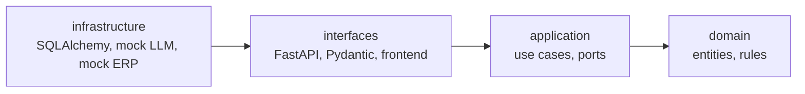
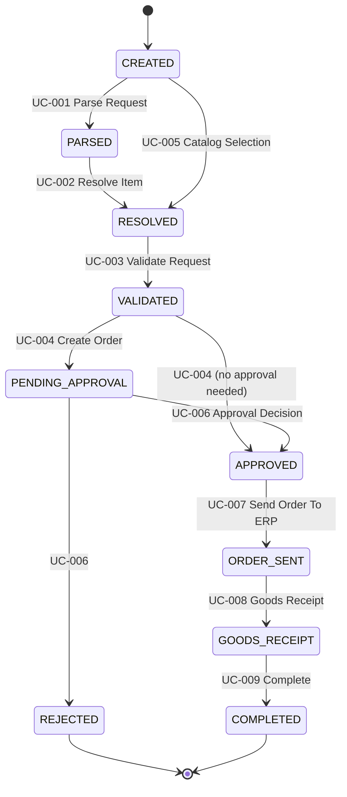

# Procurement Orchestrator

An enterprise procurement system that turns a purchase need, given as free text or
as a direct catalog selection, into a validated, approved and ERP-booked purchase
order. It enforces sourcing, budget and multi-level approval rules end to end.

Capstone project for the FHNW BSc Business Information Technology module
*AI-assisted Software Development*. Method: [AI-SDLC](https://docs.aisl.science/learning-and-resources/ai-sdlc);
project context and details: [`docs/PROJECT.md`](docs/PROJECT.md), current state: [`docs/TASKS.md`](docs/TASKS.md).

## Architecture

Clean Architecture. Dependencies point inward: `domain ← application ← interfaces ← infrastructure`.
`domain/` and `application/` import no FastAPI, Pydantic or SQLAlchemy; the unit tests run without them.



Ports (`LLMAdapter`, `ErpGateway`, repositories) are implemented in `infrastructure/` and chosen in
`interfaces/api/dependencies.py`.

## Workflow and use cases



Business rules: threshold-based approval (1000 → manager, 10000 → also budget owner), budget checked twice
(validation and just before spending), Sourcing Funnel (approved supplier, stock, lead time, cheapest;
a price tie needs a human, see ADR-002), terminal states, no duplicate approvals.

## API contract

Every endpoint returns the pipeline JSON (`requestId`, `status`, `rawText`, `parsedData`, `resolvedData`,
`validation`, `workflow` with `currentState`, `nextState` and `history`, plus `erpReference`).
Swagger UI is at `/docs`, a small demo frontend at `/`.

## Run

```bash
python demo.py                                   # whole pipeline, no install needed
pip install -e ".[dev]"
docker compose up -d db
uvicorn procurement.infrastructure.main:app --reload
```

## Test

```bash
pytest tests/unit          # domain, application, mock adapters — no database
pytest tests/integration   # repositories against Postgres
pytest tests/e2e           # full HTTP stack
```

**Status (2026-09-28):** the 64 unit tests pass (run with a stdlib pytest shim because pytest could not be
installed where they were written). The SQLAlchemy layer, the integration tests and the e2e tests have
been written and reviewed but **not executed yet**; CI runs them on every push. See `docs/TASKS.md`.

## Development process

- `AGENTS.md` is the lifecycle router; phase guidance lives in `skills/ai-sdlc-*/SKILL.md`
  (`bash scripts/setup-skills.sh <agent>` exposes it to a coding agent).
- Every use case has a specification in `docs/specs/` before its code.
- Architecture decisions are ADRs in `docs/adr/`; all are still **Proposed** until the team accepts them.
- TDD (test first, red → green → refactor) is the rule for development. The initial scaffold was produced
  with tests and code together, so its history does not show separate red steps; work from here on does.
- CI (`.github/workflows/`): structure check, lint, unit, integration and e2e tests, Docker build; `release.yml`
  for `v*` tags; `cd.yml` is inactive until deployment is configured.

## Scope and future work

Implemented: free-text and catalog intake, mock LLM, mock ERP, approval workflow, ERP hand-off.
Not implemented: OCI Punchout (ADR-005), real LLM (LiteLLM), real SAP adapter, configurable price-tie
strategy, partial stock handling, deployment on Render + Neon.
