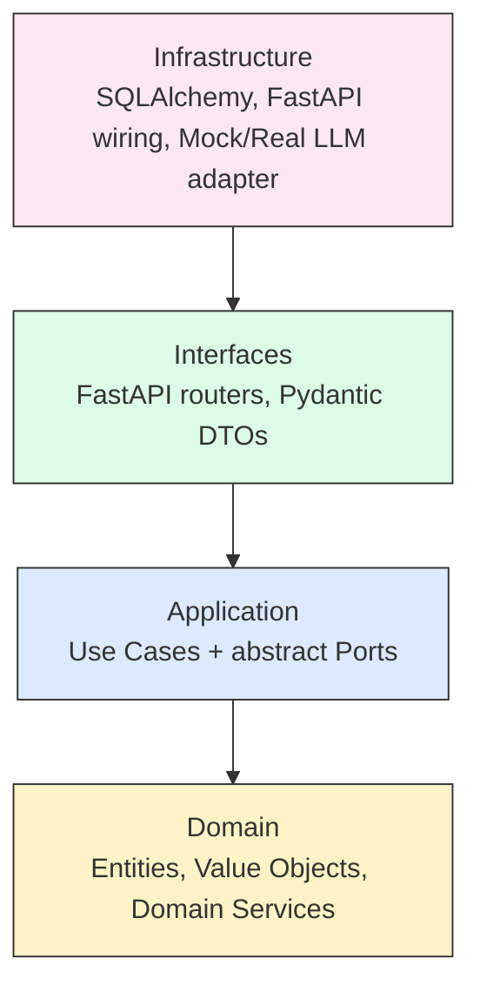
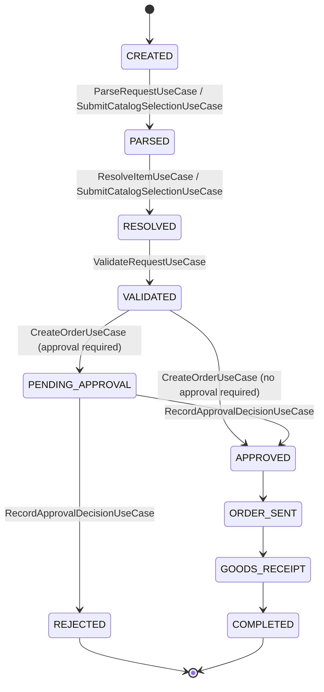

# Procurement Orchestrator

An enterprise procurement request system that turns a purchase need —
expressed as free text or a direct catalog selection — into a validated,
approved purchase order. It enforces real business rules end-to-end:
supplier/stock sourcing, budget validation, and a multi-level approval
workflow, built with Clean Architecture and strict Test-Driven Development.

Capstone project for the FHNW BSc Business Information Technology module
*AI-assisted Software Development*.

## Table of Contents

- [Architecture](#architecture)
- [Domain Model](#domain-model)
- [Sourcing Funnel & Workflow](#sourcing-funnel--workflow)
- [Use Cases](#use-cases)
- [Tech Stack](#tech-stack)
- [AI-SDLC Development Process](#ai-sdlc-development-process)
- [Running Locally](#running-locally)
- [Running Tests](#running-tests)
- [CI/CD & Deployment](#cicd--deployment)
- [Project Structure](#project-structure)
- [Team & Course Context](#team--course-context)
- [Future Work](#future-work)

## Architecture

Clean Architecture, 4 layers, with a strict Dependency Rule: dependencies
point only inward. `domain/` has **zero third-party imports** — verified
concretely, since all 44 unit tests for the domain and application layers
run without FastAPI, Pydantic, or SQLAlchemy installed.



Arrows show the allowed direction of *knowledge* (who may import whom):
Infrastructure knows Interfaces, Interfaces knows Application, Application
knows Domain — never the reverse.

## Domain Model

**Entities:** `User`, `CostCenter`, `Supplier`, `CatalogItem`,
`ProcurementRequest` (aggregate root, owns the workflow state machine),
`Approval`.

**Value Objects (immutable):** `Money`, `SKU`, `ParsedRequest`.

**Business rules (domain invariants):**

1. **Approval routing** — amount ≤ 1000 → no approval; > 1000 → `MANAGER`;
   > 10000 → also `BUDGET_OWNER` (`ApprovalRoutingPolicy`).
2. **Budget check** — enforced twice: a pre-check when validating, and a
   final, authoritative check right before spending (budget may change
   between the two).
3. **Price-tie clarification** — if two catalog items tie for the cheapest
   price, the system raises `RequiresClarificationError` instead of picking
   one silently (see `docs/adr/ADR-002`, currently `Proposed`).
4. **Terminal states** — an `APPROVED`/`REJECTED` request can never be
   modified or re-approved.
5. **No duplicate approvals** — the same approver cannot decide twice at the
   same level for the same request.

## Sourcing Funnel & Workflow

The Sourcing Funnel (`domain/services/sourcing_rules.py`) resolves a parsed
request to a single catalog item: filter by category + approved supplier →
filter by stock/lead time → rank by price → tie triggers clarification.



## Use Cases

1. `ParseRequestUseCase` — free text → structured `ParsedRequest` (via the `LLMAdapter` port).
2. `ResolveItemUseCase` — `ParsedRequest` → best-matching `CatalogItem` (Sourcing Funnel).
3. `ValidateRequestUseCase` — checks the request's amount against the cost center's budget.
4. `CreateOrderUseCase` — determines required approval levels and transitions the request.
5. `SubmitCatalogSelectionUseCase` — direct catalog intake, skipping free-text parsing.
6. `RecordApprovalDecisionUseCase` — records an approver's decision; performs the final budget deduction.

## Tech Stack

| Layer | Choice | Rationale |
|---|---|---|
| Language | Python 3.12 | Strong tooling and coding-agent support |
| API | FastAPI | Lightweight, native Pydantic integration |
| ORM | SQLAlchemy 2.0 | De facto standard Python ORM |
| Database | PostgreSQL (Neon free tier) | Zero-cost, no local setup required |
| Validation | Pydantic v2 | Kept strictly out of the domain/application layers |
| Testing | pytest + httpx | Standard, fast, agent-friendly |
| Containerization | Docker | Required for deployment on Render |
| Deployment | Render (Docker Web Service) | Free tier, course-recommended |
| CI/CD | GitHub Actions | lint → unit → integration → e2e → docker build |
| Coding agent | GitHub Copilot | Course-provided access |

## AI-SDLC Development Process

This project follows a documented, phase-based AI-assisted development
process rather than ad-hoc "vibe coding":

- **`AGENTS.md`** is a minimal router (project context, commands, phase
  list) linking to `skills/ai-sdlc-*/SKILL.md` files, which the coding
  agent loads on demand for the phase it is currently in (progressive
  disclosure — keeps the always-loaded instruction budget small).
- **Spec-Driven Development**: every use case has a Given/When/Then spec in
  `docs/specs/`, written before any implementation code.
- **Architecture Decision Records** in `docs/adr/`: each starts as
  `Proposed` and only becomes `Accepted` after an explicit team decision
  (see `docs/adr/ADR-002` for one still open).
- **Strict TDD**: Red → Green → Refactor. The full testing pyramid: unit
  tests (domain + application, in-memory fakes, no DB) → integration tests
  (real Postgres) → E2E tests (full FastAPI stack).
- Live project status is tracked in `docs/TASKS.md` (phase + status, not
  just a static plan).
- Agent-usage notes (autonomy level, good/bad suggestions, the Reflection
  pattern in practice) are kept in `docs/LEARNINGS.md` for the presentation.

## Running Locally

Zero-dependency sanity check (domain + application layers only):

```bash
python demo.py
```

Full API + frontend:

```bash
pip install -e ".[dev]"
docker compose up -d db          # local Postgres
uvicorn procurement.infrastructure.main:app --reload
# Frontend:   http://localhost:8000/
# Swagger UI: http://localhost:8000/docs
```

Or fully containerized:

```bash
docker compose up
```

The frontend (`interfaces/static/index.html`) is a minimal vanilla-JS page
that calls every endpoint directly — useful for manually walking through
both intake modes (free text and direct catalog selection) during the
presentation demo.

## Running Tests

```bash
pytest tests/unit          # domain + application — no DB required
pytest tests/integration   # requires a running Postgres (docker compose up -d db)
pytest tests/e2e           # full FastAPI stack via TestClient
```

**Status:** 44/44 unit tests are verified passing (executed repeatedly
during development). The integration and e2e test suites were written
against the same specs but, due to sandbox constraints during development,
have not yet been executed against a real Postgres instance — this is
tracked as the top backlog item in `docs/TASKS.md`. Run them and report/fix
any failures as the next step.

## CI/CD & Deployment

GitHub Actions (`.github/workflows/ci.yml`): lint (`ruff`) → unit tests →
integration tests (Postgres service container) → E2E tests → Docker build.

Deployment: push the Docker image via Render (New → Web Service → Existing
Image, or connect the repo directly), set `DATABASE_URL` to the Neon
Postgres connection string, deploy. See `docs/TASKS.md` for current status.

## Project Structure

```
procurement-orchestrator/
├── AGENTS.md
├── demo.py
├── Dockerfile
├── docker-compose.yml
├── pyproject.toml
├── skills/ai-sdlc-{0..5}-*/SKILL.md
├── src/procurement/
│   ├── domain/            # entities, value objects, domain services
│   ├── application/       # use cases + abstract ports
│   ├── interfaces/
│   │   ├── api/            # FastAPI routers, Pydantic schemas, Depends wiring
│   │   └── static/          # minimal vanilla-JS frontend (index.html)
│   └── infrastructure/    # SQLAlchemy models/repos, mock LLM adapter, DI wiring
├── tests/{unit,integration,e2e}/
└── docs/
    ├── PROJECT.md          # architecture & domain reference
    ├── TASKS.md            # live phase/status tracker
    ├── LEARNINGS.md        # presentation notes
    ├── specs/UC-00X-*.md   # Given/When/Then acceptance criteria
    └── adr/ADR-00X-*.md    # architecture decisions
```

## Team & Course Context

FHNW BSc Business Information Technology — module *AI-assisted Software
Development*, capstone project. Team of 2.

## Future Work

- **OCI Punchout catalog integration** — the third originally discussed
  intake mode (alongside free text and direct catalog selection). Requires
  an external hosted-catalog session and cXML authentication; deliberately
  out of scope for this prototype (see `docs/adr/ADR-005`).
- A real LLM provider (via LiteLLM) behind the `LLMAdapter` port, replacing
  `MockLLMAdapter`.
- SQLAlchemy-backed repositories replacing the in-memory ones (scaffolding
  already present in `infrastructure/db.py` / `infrastructure/models.py`).
- Partial-stock / backorder handling.
